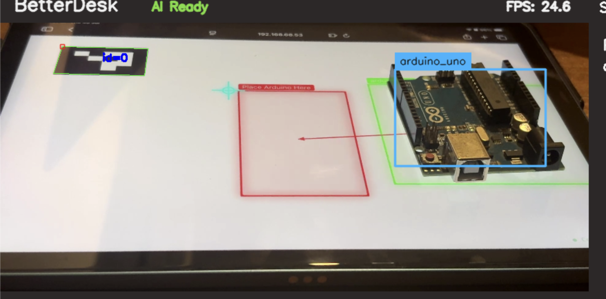
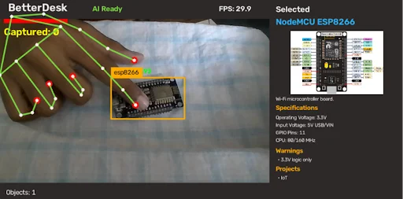

REVIEWER NOTE: PLEASE read the final journal as it contains a lot of clarification

# BetterDesk

A workbench that can **see**, **understand** and **physically interact** with everything on your desk.

---

## What is BetterDesk?

BetterDesk is an interactive workbench designed to make building electronics, robotics, hardware projects, art, etc much easier and more importantly COOLER!

Instead of just sitting there like a normal desk, BetterDesk knows whats on your workspace using multiple cameras and computer vision. It can identify components, answer questions, guide you through builds, organize your parts and even **move objects around the desk itself** using a custom built programmable motion surface.

Its like a mix between an electronics workbench, an AI assistant like clawdbot, a giant programmable trackpad, and a pick and place machine but with conveyer built technology for real world objects.

I KNOW IT SOUNDS CONFUSING BUT TRUST ME you'll understand.

---

## Why?

We all have spend a lot of time building electronics projects and somehow always the desk, laptop and brain always jumble up into 1 confusing mess of switching between videos, pin outputs, code and the physical parts randomly getting lost in the jumble of jumper wires u refuse to untangle.

Current AIs can answer questions but they ofc can't actually interact with your physical workspace.

SO after not watching the iron man movie but instead watching a yt short summary about it. I realised...

**What if the desk could become jarvis?** 
not that the desk would start flying or whatever jarvis does. But what if it could see what you're building , help you by showing instructions ON the desk itself and move components for you. 

Instead of opening another browser tab, the desk should know what you're building, point at the correct components, organize everything automatically and even move parts around for you.

---

# 4 main parts:

### 1. The software:

Ok so this is the part that makes the entire project smart. We use 2 cameras -> 1 ipad camera and 1 iphone camera (in reality you would use smaller independant cameras but we dont have budget lol) which can basically see the entire desk area. The 2 cameras are then calibrated together to create a single 3D grid using simple triangulation from calibration. This helps improve depth perception while keeping the images clear.

After getting these pics, we trained a big YOLOv11 model on approximately 4000 pictures of manually annotated electric component pics, by doing this the we find the position of the electric components on the desk as it gives cords relative to the camera visible area. So as we place 4 Araku markers around the corners with some simple subtraction it knows the exact position. All of this with the image is sent to a GPT4o api call. It identifies whats generally happening and then we pair this with our voice assistant which is just a simple open AI whispr transcriber which sends the text to the same APi call and then the response is said outloud by elevenLabs.

BUT the main thing is since we have the position of the components we can draw bounding boxes around them and then draw boxes arrows and text to where the component should be placed/ already is placed and other instructions. Also i plan to implement a feature such that the AI can look up guides and show part of the website but before that i want the projector working first as it would be much easier to know where/when/how to place the instructions. SO all of this is planned to run on the main raspberry pi 5

---

### 2. The Projector:

---

### 3. The Desk:

---

### 4. The Control Panel:

Ok so for some basic controls like controlling volume and switching between modes. We are going to build a small control panel which will connect directly to the raspberry pi. Its made up of a touch sensor layer + the LCD screen from my ender3 + arduino uno.

---

# Gallery

---

## Full CAD Assembly of Desk

---

## Full CAD Assembley of Projector

---

## FULL Wiring Diagram

---

## Current Software

  
  

---

# Future Plans

Ofc build the full thing in build review but also make software more capable than simply drawing boxes and arrows. But as i mentioned id prefer to do that after the projector is built so i can get a feel of how the instructions will look best

If You Want to run the code ,in the .env Please put an OpenAi key and a elevenlabs key and then run python src/core/detector.py