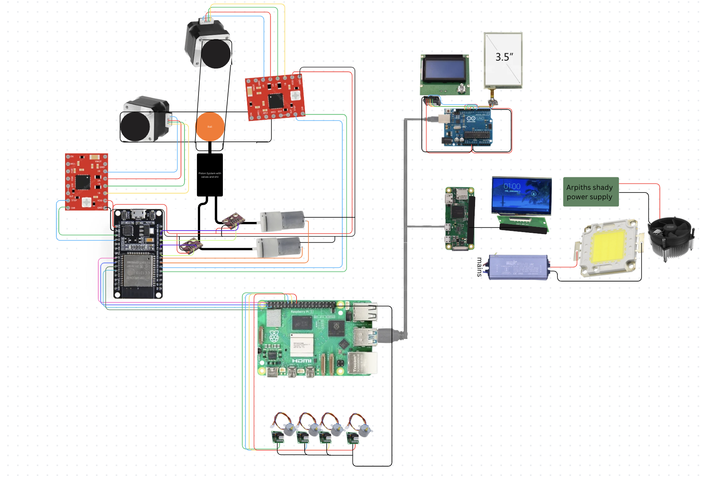

REVIEWER NOTE: PLEASE read the final journal as it contains a lot of clarification

# BetterDesk

A workbench that can **see**, **understand** and **physically interact** with everything on your desk.

- **Latest CAD model:** [https://github.com/eshantsonhar/Betterdesk---cad-model/tree/main](https://github.com/eshantsonhar/Betterdesk---cad-model/tree/main)
- **CAD Submodule Snapshot:** [`cad_files_and_step`](../cad_files_and_step) *(pinned commit for reproducible builds; auto-synced via GitHub Actions)*

---

## What is BetterDesk?

BetterDesk is an interactive workbench designed to make building electronics, robotics, hardware projects, art, etc much easier and more importantly COOLER!

Instead of just sitting there like a normal desk, BetterDesk knows whats on your workspace using multiple cameras and computer vision. It can identify components, answer questions, guide you through builds, organize your parts and even **move objects around the desk itself** using a custom built programmable motion surface.

Its like a mix between an electronics workbench, an AI assistant like clawdbot, a giant programmable trackpad, and a pick and place machine but with conveyer built technology for real world objects.

I KNOW IT SOUNDS CONFUSING BUT TRUST ME you'll understand.

---

## Why?

We all have spend a lot of time building electronics projects and somehow always the desk, laptop and brain always jumble up into 1 confusing mess of switching between videos, pin outputs, code and the physical parts randomly getting lost in the jumble of jumper wires u refuse to untangle.

Current AIs can answer questions but they ofc can't actually interact with your physical workspace.

SO after not watching the iron man movie but instead watching a yt short summary about it. I realised...

**What if the desk could become jarvis?** 
not that the desk would start flying or whatever jarvis does. But what if it could see what you're building , help you by showing instructions ON the desk itself and move components for you. 

Instead of opening another browser tab, the desk should know what you're building, point at the correct components, organize everything automatically and even move parts around for you.

---

# 4 main parts:

### 1. The software:

Ok so this is the part that makes the entire project smart. We use 2 cameras -> 1 ipad camera and 1 iphone camera (in reality you would use smaller independant cameras but we dont have budget lol) which can basically see the entire desk area. The 2 cameras are then calibrated together to create a single 3D grid using simple triangulation from calibration. This helps improve depth perception while keeping the images clear.

After getting these pics, we trained a big YOLOv11 model on approximately 4000 pictures of manually annotated electric component pics, by doing this the we find the position of the electric components on the desk as it gives cords relative to the camera visible area. So as we place 4 Araku markers around the corners with some simple subtraction it knows the exact position. All of this with the image is sent to a GPT4o api call. It identifies whats generally happening and then we pair this with our voice assistant which is just a simple open AI whispr transcriber which sends the text to the same APi call and then the response is said outloud by elevenLabs.

BUT the main thing is since we have the position of the components we can draw bounding boxes around them and then draw boxes arrows and text to where the component should be placed/ already is placed and other instructions. Also i plan to implement a feature such that the AI can look up guides and show part of the website but before that i want the projector working first as it would be much easier to know where/when/how to place the instructions. SO all of this is planned to run on the main raspberry pi 5

---

### 2. The Projector:

The projector is probably one of the weirdest parts of the project. Instead of buying a normal projector (way too expensive ), we're building one completely from scratch. It uses a 50W COB LED as the light source, which is bright enough to project onto roughly a 50cm × 50cm workspace even in a reasonably lit room. Since a 50W LED gets ridiculously hot, it's mounted to an aluminium heatsink with a CPU cooler so nothing melts. The image itself comes from the LCD panel salvaged from an old broken tablet. We literally took the tablet apart, removed the LCD (and removed it from its backlight) and use it as the projector's imaging panel. A Raspberry Pi Zero drives the LCD through a TTL display controller board.

Light from the LED passes through a condenser lens, then through the tablet LCD, before being focused by a collector lens and finally projected using a larger projection lens. Because the projector can't be mounted directly above the desk, the entire optical assembly is mounted on an adjustable mechanism with a ratchet-and-pawl locking system. A stepper motor adjusts distances between the projector and collector lens. Every mount for the lenses, LCD, LED, cooling system and adjustment mechanism is being custom designed in CAD so everything stays aligned while still being as compact (and cheap) as possible. Theres also a linear actuator which changes the angle of the projector lens to be able to focus the image using some random physics principle. It definitely isn't the easiest way to build a projector but it's a lot more fun. 

---

### 3. The Desk:

The desk movement system is one of the most complex parts of this project. It uses a grid of x and y rods moving with a suspended ball between them. A piston below the ball controls whether it touches the x rod on top or the y rod below. Each piston system is controlled in a sort of coordinate grid, in a grid formed by 10 x and 10 y pressure pipes running below the whole rod system. Suppose at a point, the system gets a positive pressure from the x pressure pipe and a positive pressure from the y pressure pipe. Then the ball moves up. If both pipes have negative pressure, the ball moves down. If both are opposite [like on positive and one negative], the ball stays stationary. The pressure in the pressure pipes are controlled by pumps, which are controlled by an ESP32. The ESP32 also controls the NEMA17 motors, which move the rods. There are a total 100 ball units, forming a grid of 10x10

---

### 4. The Control Panel:

Ok so for some basic controls like controlling volume and switching between modes. We are going to build a small control panel which will connect directly to the raspberry pi. Its made up of a touch sensor layer + the LCD screen from my ender3 + arduino uno.

---

# Gallery

---

## Full CAD Assembly of Desk

> [!TIP]
> **Latest CAD model:** [https://github.com/eshantsonhar/Betterdesk---cad-model/tree/main](https://github.com/eshantsonhar/Betterdesk---cad-model/tree/main)
>
> The repository submodule [`cad_files_and_step`](../cad_files_and_step) points to a pinned commit snapshot for build reproducibility, automatically synchronized with the CAD repository's `main` branch via GitHub Actions. If you are browsing on GitHub and want to access the live, latest CAD files and STEP models, click the link above.

---

## Full CAD Assembley of Projector

---

## FULL Wiring Diagram

---

## Current Software

  
  

---

# Bill Of Materials
| Item                                | Specific part                                | Unit Price (inr) | Quantity | Total Price ₹ | Total Price $ | URL                                                                                                                                                                                                                                                                                                                                                                                                                                                                                                                                                                                                  | Running Total ₹ | Running Total $ |
|-------------------------------------|----------------------------------------------|------------------|----------|---------------|---------------|------------------------------------------------------------------------------------------------------------------------------------------------------------------------------------------------------------------------------------------------------------------------------------------------------------------------------------------------------------------------------------------------------------------------------------------------------------------------------------------------------------------------------------------------------------------------------------------------------|-----------------|-----------------|
| Balls                               | Polypropylene Balls                          | ₹5.00            | 110      | ₹550.00       | $5.82         | https://dir.indiamart.com/impcat/polypropylene-balls.html                                                                                                                                                                                                                                                                                                                                                                                                                                                                                                                                            | ₹550.00         | $5.82           |
| Rollers                             | 50cm Aluminium rollers                       | ₹306.00          | 10       | ₹3,060.00     | $32.40        | https://www.amazon.in/Zaymircozy-Smooth-Printer-Robotics-Projects/dp/B0FH2KFWB4/ref=sr_1_1?crid=1D7NELO6CF0YH&dib=eyJ2IjoiMSJ9.c4L75VlylNFit3jmEa-eyQS7z60nxaDwS2bd5omQC_Xs0b8SHYktsCY89BLnWQkdbeI63BOTizy0DIakuKf7L7i4z-WKpDm7BW0bRJZDMVEOKkWAmOeyGsrgUmQzLQNz5zIEQDe9fUBOeAdQL13zTA.mxdXKDbGtd0etD38PiINGvbteerS3nsYuP7grgqp8ZY&dib_tag=se&keywords=aluminium+rods+50+cm+back+of+20&qid=1786555699&refinements=p_36%3A-63000&rnid=1318502031&s=industrial&sprefix=aluminium+rods+50+cm+back+of+20%2Cindustrial%2C232&sr=1-1                                                                        | ₹3,610.00       | $38.23          |
| Mosfets, Schottky diodes, Resistors | Alr have                                     | ₹0.00            | 10       | ₹0.00         | $0.00         |                                                                                                                                                                                                                                                                                                                                                                                                                                                                                                                                                                                                      | ₹3,610.00       | $38.23          |
| Motors                              | NEMA 13 STEPPER (already have from ender)    | ₹0.00            | 4        | ₹0.00         | $0.00         |                                                                                                                                                                                                                                                                                                                                                                                                                                                                                                                                                                                                      | ₹3,610.00       | $38.23          |
| Motor driver                        | A4988 motor driver with heat sink            | ₹699.00          | 1        | ₹699.00       | $7.40         | https://www.amazon.in/TESTIN-ELECTRONICS-Stepper-Heatsink-Printer/dp/B0GGTFJJT7                                                                                                                                                                                                                                                                                                                                                                                                                                                                                                                      | ₹4,309.00       | $45.63          |
| Piping                              | Polyurethane Pneumatic Air Tube              | ₹175.00          | 3        | ₹525.00       | $5.56         | https://www.amazon.in/Polyurethane-Pneumatic-Flexible-Compressor-Industrial/dp/B0HFCSDDWX/ref=sr_1_1                                                                                                                                                                                                                                                                                                                                                                                                                                                                                                 | ₹4,834.00       | $51.19          |
| Pumps                               | 6V to 12V Mini                               | ₹89.00           | 23       | ₹2,047.00     | $21.68        | https://quartzcomponents.com/products/12v-dc-1-2l-min-mini-vacuum-pump?srsltid=AfmBOoq1d-z9DCiYFECv1LNLPBb3ClF3fsWmVBt2qGRkRinZDS05aquH                                                                                                                                                                                                                                                                                                                                                                                                                                                              | ₹6,881.00       | $72.86          |
| Pressure Sensor                     | BMP280                                       | ₹34.00           | 25       | ₹850.00       | $9.00         | https://www.flyrobo.in/bmp280-barometric-pressure-and-altitude-sensor-i2c-spi-module?srsltid=AfmBOopaK0VeQkgpDOZl1-qdyk8WUkgL2_zQ5x4lKVd9bb6Lktvidx93                                                                                                                                                                                                                                                                                                                                                                                                                                                | ₹7,731.00       | $81.86          |
| LED                                 | 50W 32V Natural White SMD COB LED            | ₹699.00          | 1        | ₹699.00       | $7.40         | https://probots.co.in/50w-32v-natural-white-smd-cob-led-rectangle-light.html                                                                                                                                                                                                                                                                                                                                                                                                                                                                                                                         | ₹8,430.00       | $89.27          |
| Cooler                              | Cooler Master i30 CPU Cooler                 | ₹655.00          | 1        | ₹655.00       | $6.94         | https://www.amazon.in/Cooler-Master-i30-CPU-Aluminum/dp/B09V4PN9MX?source=ps-sl-shoppingads-lpcontext&smid=A1A1JBOUJEFFNA&th=1                                                                                                                                                                                                                                                                                                                                                                                                                                                                       | ₹9,085.00       | $96.20          |
| Condensor Lens                      | High Power LED 20-100W Lens                  | ₹300.00          | 1        | ₹300.00       | $3.18         | https://roboman.in/product/high-power-led-20-100w-lamp-bead-lens-44mm-optical-glass-lens-50-mm-reflective-collimator-fixed-bracket-60-120-degree-led-lens/                                                                                                                                                                                                                                                                                                                                                                                                                                           | ₹9,385.00       | $99.38          |
| Collector Lens                      | Convex Lens F20 D100                         | ₹300.00          | 1        | ₹300.00       | $3.18         | https://www.amazon.in/ERH-India-Magnifier-Convex-Length/dp/B09BNTC9F5?source=ps-sl-shoppingads-lpcontext&psc=1&smid=A1KKHARUWH0JG                                                                                                                                                                                                                                                                                                                                                                                                                                                                    | ₹9,685.00       | $102.56         |
| Projector Lens                      | Convex Lens F10 D75                          | ₹270.00          | 1        | ₹270.00       | $2.86         | https://www.amazon.in/Diameter-75-Science-Experiments-Projects-Microscopes/dp/B0C576XYVT?crid=378DJOR5RDQTX&dib=eyJ2IjoiMSJ9.jJLF1iHCvtPAbifj-IEcJvwmZKhfyjBUhp-5MPEKz8TykW9M1-aSITZ-6le2cAi5KoS2zFdlW54zPszDfxvu-MuEE7ZhdbVp4fCCVVYk7S1i1pGUlJTYhuSBYRYok8GqzpzrfwTCUk5D3NmVbHC-zPPoFq6ldOuNXy05ZWoQ9iwYUq6rrTB9mlPNi2SfBsWO.pA4xyLO7_SKg6Qjny2UQc4vraaFKkMVhhSD85HOlWA4&dib_tag=se&keywords=100+mm+focal+length+biconvex+lens&qid=1782578343&sprefix=100+mm+focal+length+biconvex+le,aps,273&xpid=PNhMk0UkOY3Z4                                                                                    | ₹9,955.00       | $105.41         |
| LCD display without backlight       | Extracted from eshants tablet                | ₹0.00            | 1        | ₹0.00         | $0.00         |                                                                                                                                                                                                                                                                                                                                                                                                                                                                                                                                                                                                      | ₹9,955.00       | $105.41         |
| LED driver                          | 50W LED driver                               | ₹150.00          | 1        | ₹150.00       | $1.59         | https://makerbazar.in/products/50w-led-driver-1500ma-300ma-750ma                                                                                                                                                                                                                                                                                                                                                                                                                                                                                                                                     | ₹10,105.00      | $107.00         |
| 60 pin RGB TTL breakout board       | FPC FFC 60 Pin Adapter                       | ₹101.00          | 1        | ₹101.00       | $1.07         | https://roboticsdna.in/product/fpc-60pin-cable-pitch-0-5mm-to-dip-pitch-2-54mm-smt-adapter-pcb-board/?srsltid=AfmBOor3ykh8ym4aLEzaiyzvzlYi7wKRnOwV8cFBtz1cFzFLhiNlyNFLD7E                                                                                                                                                                                                                                                                                                                                                                                                                            | ₹10,206.00      | $108.07         |
| Controller of LCD screen            | Raspberry Pi 0                               | ₹1,299.00        | 1        | ₹1,299.00     | $13.76        | https://robu.in/product/raspberry-pi-zero-v1-3-development-board/?gad_source=1&gad_campaignid=17416544847&gclid=CjwKCAjwj7HTBhBiEiwA8s35OqpUuB_Rtrcf12BnWGZDf_nnS0EhUMToca90b4wwzxZxcTHOLFYC0xoCoKQQAvD_BwE                                                                                                                                                                                                                                                                                                                                                                                          | ₹11,505.00      | $121.83         |
| Stepper Motors                      | 8BYJ-48 Stepper Motor + ULN2003 Driver       | ₹139.00          | 4        | ₹556.00       | $5.89         | https://probots.co.in/28byj-48-stepper-motor-and-uln2003-stepper-motor-driver.html?gad_source=1&gad_campaignid=15283483193&gclid=CjwKCAjwj7HTBhBiEiwA8s35OrzTDwpKqhs8q5qIXjCfNBawpBMg9aN4UWgQbE17EbHu-wku3NBP2hoCDxgQAvD_BwE                                                                                                                                                                                                                                                                                                                                                                         | ₹12,061.00      | $127.72         |
| Control Board for motors            | ESP32                                        | ₹589.00          | 2        | ₹1,178.00     | $12.47        | https://www.amazon.in/SquadPixel-ESP-32-Bluetooth-Development-Board/dp/B071XP56LM/ref=sr_1_2?crid=1DB18TWXHT64F&dib=eyJ2IjoiMSJ9.7tHski1_or_OvY6xQRgEf-AJs3OUhV7ZdzXc0Obc9YP4kvPpc1oLBq0zUI2L6Bp2U_VBEFeNf9hIrVxYdYFe37K9e0VbkSfFIqD6Y6qCfsuLKl8qhbuVtdeVOSWtOHLXVzhu2JNyNZH3XD5hzKNjKkNla6ZplYY5n4-MmLigt0Ebb92oEwiiH8Z1q0imSLV6gGBSj-8CMLMVlhlh0b4zoU0ahL15BUr0T4PDxCMF5Z_Oq-o4XBN4enprlz70zeRl6wINhQ2hitzAz5Ve_2aCB6IWtbic5sHp5GqzxWZrpX8.1SIQMXip-dlcwOIPKbZg0adfgNB8zQz2CRSgbj2aqoQ&dib_tag=se&keywords=esp32+devkit+v1&qid=1782751207&s=industrial&sprefix=esp32+dev%2Cindustrial%2C314&sr=1-2 | ₹13,239.00      | $140.19         |
| Main Control Board                  | Raspberry pi 5                               | ₹0.00            | 1        | ₹0.00         | $0.00         |                                                                                                                                                                                                                                                                                                                                                                                                                                                                                                                                                                                                      | ₹13,239.00      | $140.19         |
| Springs                             | Stainless Steel Mini Compression Springs     | ₹1.00            | 110      | ₹110.00       | $1.16         | https://www.indiamart.com/proddetail/mini-compression-springs-21559716612.html?utm_medium=prd_ads&utm_campaign=22486366449&utm_ad_group=202576351852&utm_content=product&utm_source=google&gclsrc=aw.ds&gad_source=1&gad_campaignid=22486366449&gclid=Cj0KCQjwr4jSBhCSARIsAOX1E-I4u_rEpNtxYpND3rpCS6pig6dCLbhtsXnaPAd6cAHMuX80MDCoqcYaAj8UEALw_wcB                                                                                                                                                                                                                                                   | ₹13,349.00      | $141.35         |
| Camera                              | Phone camera + ipad camera (already have)    | ₹0.00            | 1        | ₹0.00         | $0.00         |                                                                                                                                                                                                                                                                                                                                                                                                                                                                                                                                                                                                      | ₹13,349.00      | $141.35         |
| Resin                               | Fast Curing UV Epoxy Resin                   | ₹399.00          | 4        | ₹1,596.00     | $16.90        | https://www.amazon.in/Resin-Hard-Type-Crystal-Clear/dp/B0GYFDFBJT?th=1                                                                                                                                                                                                                                                                                                                                                                                                                                                                                                                               | ₹14,945.00      | $158.25         |
| UV light                            | Ultra Violet LED UV Light 390-395nm Purple   | ₹289.00          | 2        | ₹578.00       | $6.12         | https://www.amazon.in/Invento-Violet-390-395nm-Purple-Projects/dp/B07GD1G6H3/ref=sr_1_42?crid=3FFMIB4GTE2NQ&dib=eyJ2IjoiMSJ9.-0sRItoAZHqg9DhaTn_eb9PmJbZ9qW4ITSWnLCecbvN3PQOBDA2bwqL7qDGKXmGkLEfYcwZ1jRyyqUVeEP-CdVdrPaE6IFW_ODcZURScDhBHsGZshUIs8DUfPA7do8_oKyC7Oa6mMaLWB_vUkx1dLrvyR2mLfPMkgWZwhD94j97OoNlAKRX08tdnfqDnpt83iZNScQ5s_fKBLKnLtF4JCj5D5E4ql-GFmRxwMB89TdMr8UNKQzRbjmw0DMBeLLo0786lj6Oirei3shOg2S5xcpj69bOCz4lC0FBWRJxxoZ0.a5j3wMdOJoUNxmgL8RbHXcWWEJ188S1JxUK811UAIVw&dib_tag=se&keywords=uv+led&qid=1787293175&sprefix=uv+led%2Caps%2C276&sr=8-42                                    | ₹15,523.00      | $164.37         |
| 3D Printing                         | lots of parts (mostly self funded)           | ₹0.00            | 1        | ₹0.00         | $0.00         |                                                                                                                                                                                                                                                                                                                                                                                                                                                                                                                                                                                                      | ₹15,523.00      | $164.37         |
| Control Panel Board                 | Arduino Uno (alr have)                       | ₹0.00            | 1        | ₹0.00         | $0.00         |                                                                                                                                                                                                                                                                                                                                                                                                                                                                                                                                                                                                      | ₹15,523.00      | $164.37         |
| Control Panel Display               | Scrapped from Ender 3 LCD                    | ₹0.00            | 1        | ₹0.00         | $0.00         |                                                                                                                                                                                                                                                                                                                                                                                                                                                                                                                                                                                                      | ₹15,523.00      | $164.37         |
| Control Panel Touchscreen           | 3.5 inch 4 Wire Resistive Touch Screen Panel | ₹150.00          | 1        | ₹150.00       | $1.59         | https://kitsguru.com/products/3-5-inch-4-wire-resistive-touch-screen-panel?variant=40708852580533&country=IN&currency=INR.com                                                                                                                                                                                                                                                                                                                                                                                                                                                                        | ₹15,673.00      | $165.96         |
| Control Panel Touch controller      | 5767 TSC2046 SPI Resistive Touch             | ₹581.00          | 1        | ₹581.00       | $6.15         | https://www.fabtolab.com/adafruit-5767-tsc2046-spi-resistive-touch-screen-controller                                                                                                                                                                                                                                                                                                                                                                                                                                                                                                                 | ₹16,254.00      | $172.12         |

---

# Future Plans

Ofc build the full thing in build review but also make software more capable than simply drawing boxes and arrows. But as i mentioned id prefer to do that after the projector is built so i can get a feel of how the instructions will look best

If You Want to run the code ,in the .env Please put an OpenAi key and a elevenlabs key and then run python src/core/detector.py
